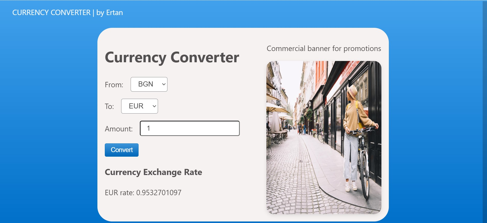
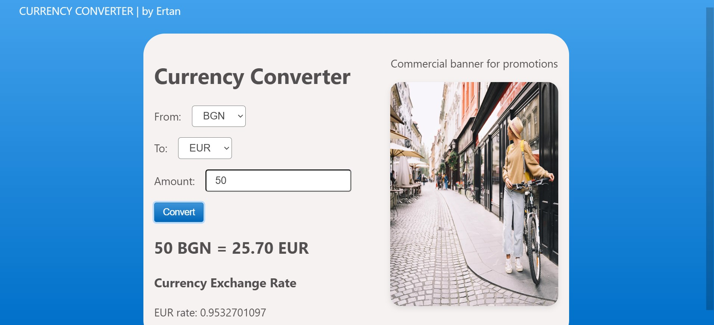

# Currency Converter App
This project is a simple Currency Converter Application built using React and styled with CSS. The app fetches live exchange rate data from the Free Currency API, allowing users to convert amounts between different currencies.

- <p></p>
- <p></p>

## Features
- Convert between multiple currencies using live exchange rates.
- Supports input validation for the amount to be converted.
- Caches API responses locally to reduce redundant API calls and enhance performance.
- Displays the latest exchange rate for the selected target currency.
- Responsive design for a seamless user experience on different devices.
   
## Built With
 - React - Front-end JavaScript library for building user interfaces.
 - Vite - Next-generation front-end tooling for fast development.
 - Freecurrency API - Provides current currency rates.

## Key Files and Functionality
**App.jsx:**
- Manages state for:
  - Exchange rate data (currencyData)
  - Input amount (amount)
  - Selected currencies (fromCurrency, toCurrency)
  - Converted amount (convertedAmount)
- Fetches exchange rate data using Free Currency API.
- Implements localStorage caching to store exchange rate data for up to 24 hours.
- Handles currency conversion based on user input.
  
**Main.jsx:**
- Displays the exchange rate for the selected target currency (toCurrency).
  
**index.css**
- Provides styling for the app, including responsive design and hover effects.
  
**index.html**
- The HTML template used to render the React app.

## How It Works
1. API Fetching & Caching:
 - On startup, the app checks if exchange rate data exists in localStorage and is valid (not expired).
 - If valid cached data is found, it is used to populate the state.
2. If no valid cached data exists, a new API request is made to fetch the latest exchange rates.
Currency Conversion:
 - The conversion formula is applied:
```makefile
convertedAmount = (amount * toRate) / fromRate
```
3. User Input:
 - The user selects fromCurrency, toCurrency, and inputs the amount.
 - Clicking the Convert button triggers the conversion and displays the result.
4. Responsive Design:
 - The layout adjusts to different screen sizes, ensuring usability on mobile and desktop devices.

## Links
 - [Freecurrency API](https://freecurrencyapi.com/)
## License
This project is open source and available under the MIT License.

